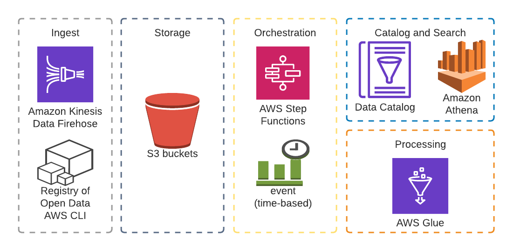
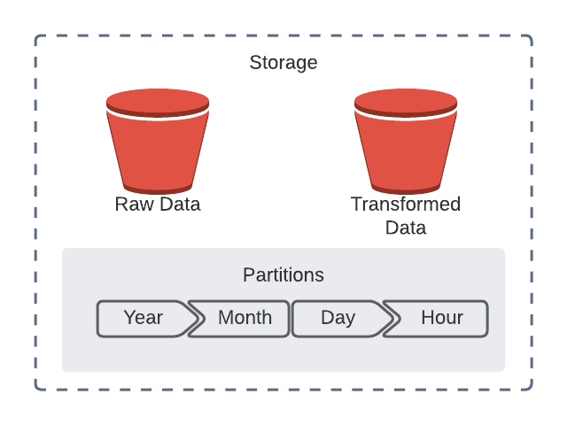
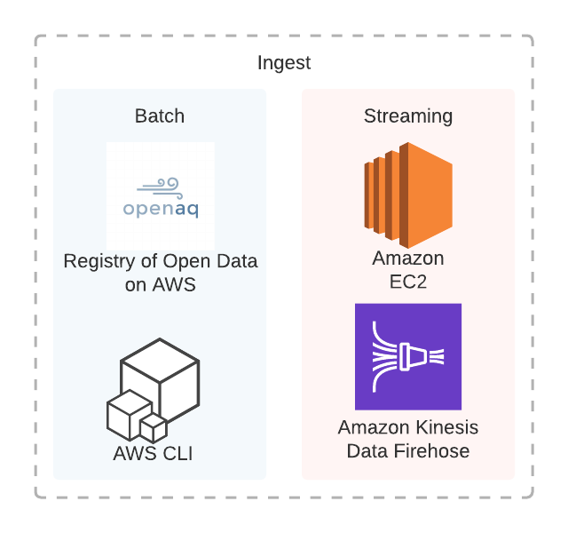
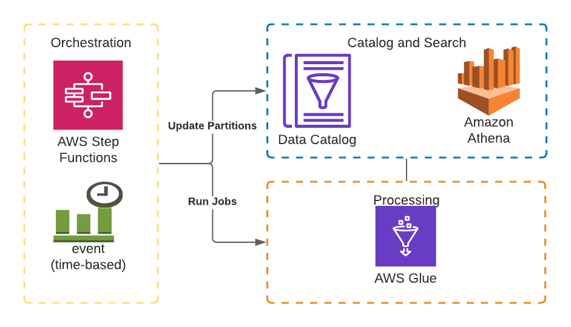

# Description
AQS is a Data Lake that stores streamed Air Quality data. The entire architecture, as shown bellow, is based on AWS Services. This documentation is meant to show you, how you can replicate it. Since it extensively uses AWS you should have an AWS account. Beware that some of the services used are not under the AWS free tier, so using them may incur in charges to your account. 

# Storage

The heart of the data lake is it's storage layer, for it we'll use Amazon S3, which is a very robust object storage service. Here we'll place our data based on the several possible transformations we might perform on it. Since we can't possibly know which transformations may be needed in the future, we want our raw data to be immutable, for this reason we'll designate a bucket for it. I'll call it the raw-data bucket. For simplicity, this project only defines a single ETL, that means we'll only need one extra bucket. I'll call this other bucket the trans-data bucket. To better organize the data, we'll partition it based on the time of ingestion, from the year down to the hour.

To facilitate the creation of the infrastructure, I've provided some CloudFormation templates you can use. For this section, the relevant template is `config/CloudFormationS3.yaml`. It'll create three S3 buckets, the two mentioned above, and a third one needed by Amazon Athena.

If you prefer not to use the template, you can use the AWS CLI or I'll walk you through using the Web Console.

To create the buckets we need, log-in to the web console, in the search bar type S3, select it, and then press create bucket. Here under bucket name choose a unique name, leave everything as is, and press create bucket at the bottom. Create one bucket to store raw data and other to store the transformed data.

# Ingestion

For ingestion, I chose to perform a first load using a batch approach and then I set up the infrastructure for streaming the data in. If you want, you can skip the batch part entirely.

## Batch

For the batch load I used data from the Registry of Open Data on AWS, specifically data from OpenAQ, what I did there was copy a couple files from one of their buckets into the raw-data bucket. To do this I strongly recommend using the AWS CLI. This is a sample command you can use to perform the same operation ` aws s3 cp s3://openaq-fetches/daily/2017-09-07.csv s3://xxxxxxxx-air-quality-raw/year=2021/month=2/day=10/hour=20/`. Notice the `year=####, month=#` syntax, this performs the partition on data, even though you could avoid putting `year=, month=, ...` and only put the number, It's recommended you use that syntax so the glue crawlers can better identify your partitions. Each partition will look like a folder on S3. I recommend you choose files under `s3://openaq-fetches/daily/` since that's the data format I used for the streaming data. In the case you chose to perform this step, you may want to crawl the data before streaming new data in. This is because this data is in csv format while the streamed data will arrive in JSON format, and that'll make it slightly more difficult to properly crawl the data.

## Streaming

To stream the data in we'll use Amazon Kinesis Firehose. I provide a CloudFormation template to create a Delivery Stream, the relevant template is, `config/CloudFormationFirehose.yaml`.

To create it manually, go to Kinesis service in the Web Console, under Data Firehose press create delivery stream. Here enter a name, then press Next. Next again. Now Under S3 destination select the raw-data bucket you created previously, and under S3 prefix put the following `year=!{timestamp:YYYY}/month=!{timestamp:M}/day=!{timestamp:d}/hour=!{timestamp:H}/` this tells the stream to partition data how we want it. Optionally under S3 error prefix put the following  `error=!{firehose:error-output-type}/!{timestamp:yyyy/MM/dd}`. Press Next. Here change Buffer size to 1, and Buffer interval to 60. Press Next, and finally select Create delivery stream.

To generate data for the stream I provide a script `scripts/DataGenerator.py`. It generates random AQ data. It receives the Delivery Stream Name as a parameter (`--StreamName`). For it to work you have to have the AWS CLI set up, or alternatively you can run it from Amazon EC2 instances.

# Catalog & Search

The catalogue contains meta-data of what's in your data lake, to create it we'll use AWS Glue Crawlers.

First, we'll create a crawler for the raw data.

To create a crawler search for AWS Glue in the web console, select it, and then press on Crawlers on the side-bar. Here, press Add crawler, enter a name and Next. Next again. Here for the Include path enter the raw-data bucket and Next. Again, Next. Here create a new role or pick an existing one. Next. Leave Frequency as Run on demand and Next. Press Add database, enter a Database name (for the database name avoid using hyphens '-') and Create, finally press Next and Finish.

Once the crawler is created, run it by selecting it and hitting Run crawler.

Once finished press on Tables on the Sidebar. You should see a newly created table. If you select it, the Schema should look similar to the one bellow

# Processing

To transform our data we'll use Glue Jobs.

For simplicity we'll only make one simple ETL which will consist on changing the original data format to a columnar format (Parquet), and on dropping a few fields. The job we'll create will automatically run hourly, to achieve that we'll use AWS Step Functions with CloudWatch Events.

First we'll create a Glue job, to do this, on the Web Console, search for AWS Glue, and then, on the side-bar, select Jobs. Here press Add job, name it, pick a role, make sure Spark 2.4, Python 3 is selected under Glue version, enter a name for your script file under Script file name and press Next. As a data source pick the raw-data bucket and Next, leave Change schema, and Next, for data target choose the trans-data bucket, Next and finally press Save job and edit script.

I've provided a script, `scripts/AirQualityToColumnarFormatHourly.py`. It grabs data generated in the last hour by filtering using the partitions, changes its format, and drops a few fields before saving them. You'll have to replace the SOURCE and TARGET variables appropriately.

Notice that Glue allows you to attach triggers to your jobs to run them automatically, the problem with these triggers is that if your data has new partitions, which will be the case for us every new hour, those new partitions won't be in your catalogue, and therefore will be ignored by your Glue Job, to solve that we'll instead use AWS Step Functions and CloudWatch Events.

We'll start by creating the Step Function. I provide a CloudFormation template you can use, `config/CloudFormationStepFunction.yaml`. 

In the web console search for Step Functions, and press Create state machine. Under definition replace the JSON with the JSON provided at `config/StepFunction.json`. This state machine will first update the raw data catalogue partitions using Athena. It will then run the Glue Job, and finally, it'll update the transformed data catalogue partitions using Athena. Make sure to replace DATABASE_NAME with the name of the database of your Glue Catalogue, and TABLE_NAME with the appropriate table names of the catalogue for the raw data and the transformed data, also change the job name if needed. Press Next, Enter a name for your State machine, select or create a IAM Role, and finally press Create state machine.

Now to schedule the function to run hourly we'll use CloudWatch events. There is a CloudFormation template for it, `config/CloudFormationCWRule.yaml`.

In the web console search for cloudwatch. Here, under Events, select Rules, and press Create rule. Under event Source select Schedule, and then Cron expression. Enter the following expression: `0 0/1 ? * * *`

Under Targets press on Add target, pick Step Functions state machine, select the previously created state machine, and go to Configure details. Enter a name for the rule and press Create rule.

# Visualization

Columnar formats are optimal for BI tools. You can use Amazon QuickSight connected to Amazon Athena to easily build visualizations from the data stored in parquet format.