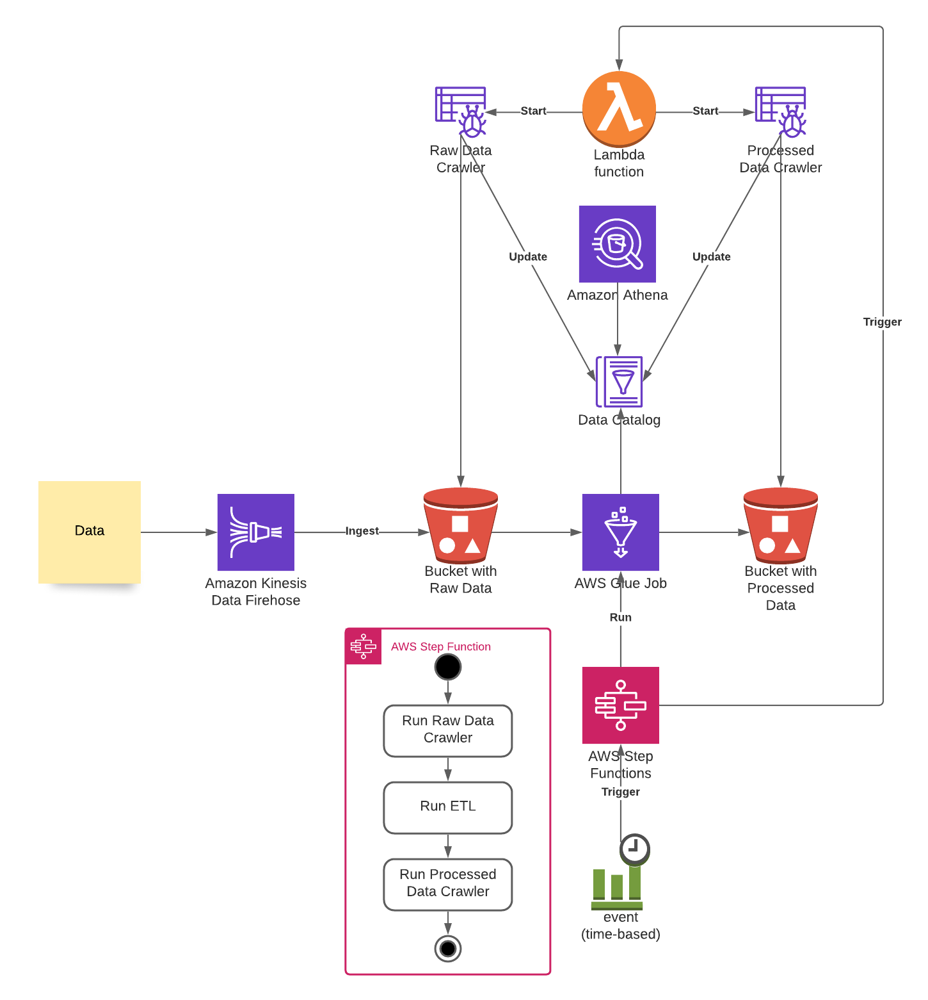

# AQS
Air Quality Streaming. It consists of a Data lake built with AWS services aimed to collect and process streaming data. 

Data can be simulated using [AQS-Generators](https://github.com/valentarmo/AQS-Generator), and a CI/CD Pipeline can be setup using [AQS-Builder](https://github.com/valentarmo/AQS-Builder).

## Overview

## Buckets
Due to how buckets work its better to create beforehand.

    $ python scripts/deploy-buckets.py \
        --StackName <Name for the Stack> \
        --S3GlueBucketName <S3 Bucket Name> \
        --S3RawDataBucketName <S3 Bucket Name> \
        --S3ProcessedDataBucketName <S3 Bucket Name> \
        --S3AthenaBucketName <S3 Bucket Name> \
        --S3GlueScriptsBucketName <S3 Bucket Name> \
        --S3TaskcatBucketName <S3 Bucket Name>

## Infrastructure Testing
The CloudFormation stack can be tested using taskcat. To do it, an appropriate `.taskcat.yml` file can be generated using `scripts/create-taskcat-file.py`. It will generate the `.taskcat.yml` file in the project's root folder.

    $ python scripts/create-taskcat-file.py \
        --Region <AWS Region> \
        --S3GlueBucketName <S3 Bucket Name> \
        --S3RawDataBucketName <S3 Bucket Name> \
        --S3ProcessedDataBucketName <S3 Bucket Name> \
        --S3AthenaBucketName <S3 Bucket Name> \
        --S3GlueScriptsBucketName <S3 Bucket Name> \
        --S3TaskcatBucketName <S3 Bucket Name>
    $ taskcat test run

## Deployment
The deployment is performed using CloudFormation and python scripts.

    $ python scripts/deploy.py \
        --StackName <Name for the Stack> \
        --S3GlueBucketName <S3 Bucket Name> \
        --S3RawDataBucketName <S3 Bucket Name> \
        --S3ProcessedDataBucketName <S3 Bucket Name> \
        --S3AthenaBucketName <S3 Bucket Name> \
        --S3GlueScriptsBucketName <S3 Bucket Name>